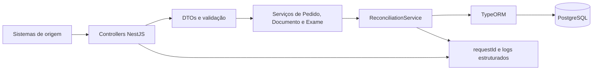

# Med-desafio

API REST para o desafio técnico de integração de pedidos, documentos e exames.
Ela recebe informações em qualquer ordem, persiste cada mensagem e reconcilia
os relacionamentos assim que houver dados suficientes.

O [enunciado original](docs/desafio.md) é a fonte de verdade das regras
funcionais.

## Visão geral

O elo entre o procedimento solicitado e o Exame que chegou à plataforma é o
`AccessionNumber`. Nenhum recurso depende de outro já estar presente:

```text
receber -> validar -> persistir -> reconciliar -> vincular -> atualizar estado
```

Exemplos suportados:

- Pedido -> Documento -> Exame;
- Exame -> Pedido -> Documento;
- Documento -> Pedido -> Exame;
- reenvio de Pedido com itens novos;
- reenvio idêntico de Exame;
- múltiplos Documentos e Exames correlacionados a um Pedido.

O escopo é intencionalmente pequeno: não há parsing DICOM/HL7 real,
autenticação, mensageria, cache distribuído, AWS, microsserviços ou front-end.

## Documentação

- [Enunciado do desafio](docs/desafio.md)
- [Domínio](docs/dominio.md)
- [Fluxos de integração](docs/fluxo-integracao.md)
- [Decisões técnicas](docs/decisoes-tecnicas.md)
- [Modelo de dados e diagrama ER](docs/modelo-dados.md)
- [Níveis de entrega](docs/niveis-de-entrega.md)
- [Roteiro auditável](docs/roteiro-auditoria.md)
- [Matriz de auditoria da entrega](docs/auditoria-entrega.md)

## Arquitetura



Controllers cuidam do contrato HTTP. Serviços de recurso persistem os dados, e
`ReconciliationService` centraliza a correlação para que a regra não fique
espalhada entre endpoints.

Cada escrita que também altera registros relacionados é feita em transação. Se
a reconciliação falhar, a mensagem recebida e seus vínculos derivados não ficam
parcialmente persistidos.

```text
src/
  pedidos/       # endpoints e caso de uso de pedidos
  documentos/    # endpoints e caso de uso de documentos
  exames/        # endpoints e caso de uso de exames
  integration/   # reconciliação centralizada
  database/      # entidades, DataSource e migrations
  common/        # validação, erros, logs e request context
  health/        # healthcheck
test/            # E2E com Nest, Supertest e PostgreSQL
```

## Modelo de dados

O diagrama ER completo, campos e justificativas estão em
[docs/modelo-dados.md](docs/modelo-dados.md).

| Entidade | Papel | Proteções no banco |
| --- | --- | --- |
| `pedidos` | Solicitação de exames. | `UNIQUE(codigo_pedido)` |
| `itens_pedido` | Procedimento solicitado; não é o Exame recebido. | FK para Pedido e `UNIQUE(pedido_id, codigo_item_pedido)` |
| `exames` | Evento de Exame efetivamente recebido. | `UNIQUE(accession_number)` |
| `documentos` | Anexo referente a Pedido; pode aguardá-lo. | `UNIQUE(codigo_pedido_referencia, codigo_documento)` e FK composta após resolução |
| `documentos_exames` | Vínculo N:N auditável entre Documento e Exame. | PK composta `(documento_id, exame_id)` |

Identificadores externos são armazenados como texto para preservar zeros à
esquerda. Entradas numéricas do enunciado são convertidas para texto; a
normalização é mínima: `trim` e comparação textual exata.

`accession_number` é globalmente único apenas como premissa deste desafio.
Em uma integração hospitalar real, a identidade pode exigir emissor, unidade
ou domínio adicionais.

## Reconciliação e estados

A reconciliação ocorre no momento de cada escrita, sem cron:

1. valida e persiste Pedido, Documento ou Exame;
2. correlaciona ItemPedido e Exame por `AccessionNumber`;
3. resolve Documento pendente quando seu Pedido fica disponível;
4. cria somente vínculos Documento–Exame ausentes;
5. atualiza os estados materializados.

`Pedido.Integrado` fica `true` quando **ao menos um** ItemPedido possui um
Exame correspondente. O enunciado não fornece estado parcial.

`Documento.Integrado` fica `true` quando há ao menos um vínculo em
`documentos_exames`. O documento é ligado a todos os Exames já
correlacionados aos itens do Pedido; chegada posterior de Exame cria apenas os
vínculos que faltam.

Um job periódico poderia ser mecanismo adicional de recuperação em produção,
mas não é necessário para o fluxo normal deste desafio.

## Reenvios e conflitos

O enunciado não define o comportamento para mensagens repetidas e divergentes.
As premissas abaixo evitam alteração silenciosa de dados:

| Requisição repetida | Comportamento |
| --- | --- |
| Pedido com mesmo `CodigoPedido` e mesmo cabeçalho | Reutiliza o Pedido e adiciona somente ItemPedido novo. Retorna `200 OK`. |
| Item com mesmo `CodigoItemPedido` e mesmos dados | É ignorado, sem duplicação. |
| Pedido ou ItemPedido existente com dados divergentes | `409 Conflict`; a primeira mensagem não é modificada silenciosamente. |
| Exame com mesmo `AccessionNumber` e mesmos dados | É idempotente, reconcilia novamente e retorna `200 OK`. |
| Exame com mesmo accession e dados divergentes | `409 Conflict`. |
| Documento com mesmo `CodigoDocumento + CodigoPedido` | `409 Conflict`, como exige o desafio. |

A PK composta de `documentos_exames`, somada à inserção idempotente, impede
vínculos duplicados mesmo se a reconciliação for executada mais de uma vez.

## API

- Base local: `http://localhost:3000`
- Swagger: [http://localhost:3000/docs](http://localhost:3000/docs)
- OpenAPI JSON: [http://localhost:3000/docs-json](http://localhost:3000/docs-json)
- Healthcheck: [http://localhost:3000/health](http://localhost:3000/health)

Os campos externos preservam a capitalização do enunciado. Identificadores são
retornados como strings para preservar sua representação.

| Método e rota | Sucesso | Corpo |
| --- | --- | --- |
| `POST /pedidos` | `201 Created` novo; `200 OK` reenvio válido | `PedidoResponse` |
| `POST /documentos` | `201 Created` | `DocumentoResponse` |
| `POST /exames` | `201 Created` novo; `200 OK` reenvio idêntico | `ExameResponse` |
| `GET /pedidos/:codigoPedido` | `200 OK` | `PedidoResponse` |
| `GET /documentos/:codigoPedido` | `200 OK` | lista de `DocumentoResponse` |
| `GET /exames/:accessionNumber` | `200 OK` | `ExameResponse` |
| `GET /health` | `200 OK` | `{ "status": "ok" }` |

O Swagger descreve DTOs, exemplos, status e respostas de erro de todas as
rotas.

### Requests de referência

`POST /pedidos`

```json
{
  "CodigoPedido": 616,
  "NomePaciente": "ALEFHER MONTONI DE ALMEIDA",
  "DataNascimento": "19970601",
  "Sexo": "M",
  "CodUnidade": 104,
  "Exames": [
    {
      "CodigoItemPedido": 930,
      "AccessionNumber": "930",
      "Modalidade": "CR",
      "NomeProcedimento": "RX ANTEBRACO ESQUERDO"
    }
  ]
}
```

`POST /documentos`

```json
{
  "CodigoDocumento": 251,
  "CodigoPedido": 616,
  "NomeDocumento": "PEDIDO",
  "Documento": "base64"
}
```

`POST /exames`

```json
{
  "AccessionNumber": "930",
  "NomePaciente": "ALEFHER MONTONI DE ALMEIDA",
  "Modalidade": "CR",
  "Status": "NOVO"
}
```

### Contratos de resposta

`PedidoResponse`:

```json
{
  "CodigoPedido": "616",
  "NomePaciente": "ALEFHER MONTONI DE ALMEIDA",
  "DataNascimento": "19970601",
  "Sexo": "M",
  "CodUnidade": "104",
  "Integrado": false,
  "Exames": [
    {
      "CodigoItemPedido": "930",
      "AccessionNumber": "930",
      "Modalidade": "CR",
      "NomeProcedimento": "RX ANTEBRACO ESQUERDO"
    }
  ],
  "CreatedAt": "2026-09-23T12:00:00.000Z",
  "UpdatedAt": "2026-09-23T12:00:00.000Z"
}
```

`DocumentoResponse` contém `CodigoDocumento`, `CodigoPedido`,
`NomeDocumento`, `Documento`, `Integrado`, `Exames`, `CreatedAt` e
`UpdatedAt`. Cada Exame vinculado expõe `AccessionNumber`, `Modalidade`
e `Status`.

`ExameResponse` contém `AccessionNumber`, `NomePaciente`,
`Modalidade`, `Status`, `Documentos`, `CreatedAt` e `UpdatedAt`.
Cada Documento vinculado expõe `CodigoDocumento`, `CodigoPedido` e
`NomeDocumento`.

`DataNascimento` aceita e devolve `YYYYMMDD`; antes de persistir, a API
valida que representa uma data real.

### Erros

As respostas de erro seguem o mesmo formato e não expõem stack trace:

```json
{
  "statusCode": 409,
  "timestamp": "2026-09-23T12:00:00.000Z",
  "path": "/documentos",
  "requestId": "auditoria-documento-duplicado",
  "message": "Já existe documento com CodigoDocumento e CodigoPedido informados.",
  "error": "Conflict",
  "errorCode": "HTTP_409"
}
```

| Status | Situação |
| --- | --- |
| `400 Bad Request` | Campo ausente, tipo inválido, campo extra, data inválida ou identificador inválido. |
| `404 Not Found` | Recurso solicitado em GET não existe. |
| `409 Conflict` | Documento duplicado, reenvio divergente ou violação de unicidade. |
| `500 Internal Server Error` | Falha inesperada; detalhes técnicos ficam nos logs. |
| `503 Service Unavailable` | Healthcheck sem acesso ao banco. |

## Logs e request ID

Cada requisição recebe `x-request-id`:

- um valor seguro enviado pelo cliente é reutilizado;
- sem header válido, a API gera UUID;
- o header é devolvido na resposta;
- logs JSON estruturados incluem esse identificador.

Os eventos registram recebimento/criação/reuso de recursos, reconciliação,
vínculos, resultado HTTP e erros. O logger não registra o corpo HTTP e redige
conteúdo de documento e outros campos sensíveis quando recebidos como
metadados.

```bash
curl -i -H 'content-type: application/json' -H 'x-request-id: auditoria-pedido-616' -d '{"CodigoPedido":616,"NomePaciente":"PACIENTE","DataNascimento":"19970601","Sexo":"M","CodUnidade":104,"Exames":[{"CodigoItemPedido":930,"AccessionNumber":"930","Modalidade":"CR","NomeProcedimento":"RX"}]}' http://localhost:3000/pedidos
```

## Pré-requisitos

- Node.js 22 ou superior;
- npm;
- PostgreSQL 16 ou compatível, **ou** Docker com Docker Compose.

## Configuração

Crie o ambiente local:

```bash
cp .env.example .env
```

| Variável | Padrão | Finalidade |
| --- | --- | --- |
| `PORT` | `3000` | Porta HTTP. |
| `DB_HOST` | `localhost` | Host PostgreSQL. |
| `DB_PORT` | `5432` | Porta PostgreSQL. |
| `DB_USERNAME` | `postgres` | Usuário do banco. |
| `DB_PASSWORD` | `postgres` | Senha de desenvolvimento. |
| `DB_DATABASE` | `med_desafio` | Banco principal. |
| `RUN_MIGRATIONS_ON_START` | `false` | Aplica migrations no boot quando `true`. |

`.env` não é versionado. Não use senhas ou tokens reais em
`.env.example` nem em commits.

## Execução local

Instale dependências:

```bash
npm ci
```

Com PostgreSQL configurado em `.env`, aplique o schema e inicie:

```bash
npm run migration:run
npm run start:dev
```

Para usar somente o banco do Compose no desenvolvimento local:

```bash
docker compose up -d db
npm run migration:run
npm run start:dev
```

O projeto não usa `synchronize: true`; o schema é criado por migrations
TypeORM. Para inspecionar o estado delas:

```bash
npm run migration:show
```

## Docker Compose

Para subir API e PostgreSQL:

```bash
docker compose up --build
```

O serviço `api` aguarda o healthcheck do banco e inicializa com
`RUN_MIGRATIONS_ON_START=true`, aplicando migrations no boot. A API usa a
porta `PORT` (3000 por padrão); o PostgreSQL usa `DB_PORT` (5432 por
padrão).

```bash
# segundo plano e inspeção
docker compose up --build -d
docker compose ps

# parar preservando os dados
docker compose down
```

Para simular uma instalação sem dados anteriores:

```bash
docker compose down -v
docker compose up --build
```

> Atenção: `docker compose down -v` remove o volume PostgreSQL do projeto.

## Testes e verificações

Testes unitários cobrem validação de data, geração/reuso de `requestId` e
redação de logs. Os E2E inicializam a aplicação Nest, exercitam sua API por
Supertest e usam PostgreSQL real; migrations são aplicadas no banco de teste e
as tabelas são limpas entre cenários.

O serviço `db` do Compose cria também `med_desafio_test` para E2E. Antes
de rodá-los localmente:

```bash
docker compose up -d db
npm run test:e2e
```

Comandos disponíveis:

```bash
npm run lint
npm run format:check
npm run build
npm test
npm run test:cov
npm run test:e2e
```

Os E2E cobrem Pedido pendente, Exame antes de Pedido, Documento antes de
Pedido, Documento posterior a Pedido integrado, reenvio com Item novo,
Documento duplicado, múltiplos documentos/exames, idempotência de Exame,
erros de validação, GET inexistente, health/Swagger e rollback de transação.

O workflow [CI](.github/workflows/ci.yml) repete lint, formatação, testes
unitários, E2E contra PostgreSQL e build em pushes e pull requests para
`main`.

Os comandos são a evidência verificável da entrega. Este README não substitui
a execução efetiva de lint, build, testes, Compose e smoke test no ambiente
que estiver avaliando o projeto.

## Smoke test manual

Com a API em execução:

1. envie `POST /pedidos` e confirme `Integrado: false`;
2. envie `POST /documentos` com o mesmo `CodigoPedido` e confirme
   `Exames: []`;
3. envie `POST /exames` com o `AccessionNumber` do ItemPedido;
4. consulte `GET /pedidos/616`, `GET /documentos/616` e
   `GET /exames/930`;
5. confirme Pedido e Documento integrados e o vínculo visível nas respostas;
6. reenvie o Pedido com ItemPedido novo e confirme que o antigo não duplicou;
7. reenvie o Documento e confirme `409 Conflict`.

Os payloads e a conferência detalhada estão em
[docs/roteiro-auditoria.md](docs/roteiro-auditoria.md).

## Limitações e evoluções conscientes

- `AccessionNumber` globalmente único é premissa do desafio, não regra
  universal;
- a correlação usa somente `AccessionNumber`; nome do paciente e modalidade
  são persistidos, mas não bloqueiam a associação;
- `integrado` significa que existe ao menos uma integração, não que todos os
  itens foram recebidos;
- documento é armazenado como texto no PostgreSQL, sem storage externo ou
  validação clínica de Base64;
- não há exclusões, autenticação ou controle de concorrência avançado;
- não há cron; reprocessamento periódico seria uma evolução operacional.

Evoluções coerentes seriam política de atualização de eventos de Exame,
escopo de `AccessionNumber` por emissor/unidade, métricas, retenção de
documentos e reprocessamento periódico de recuperação.
